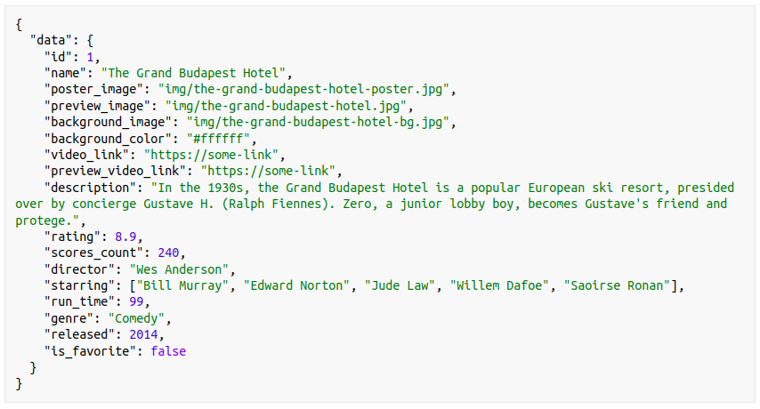
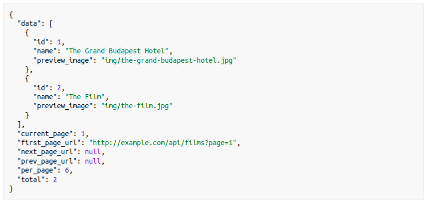
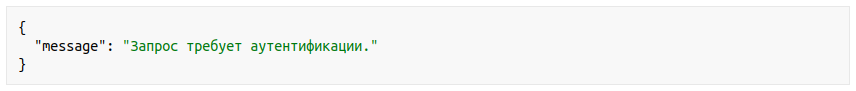
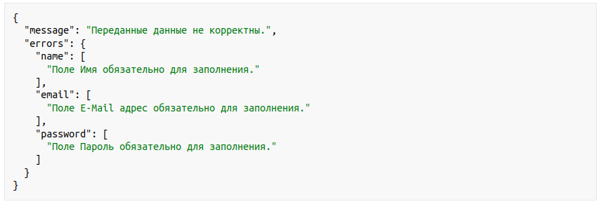
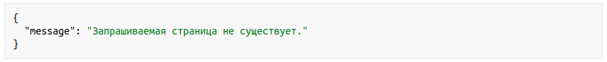

# Техническое задание "What To Watch"

---

## 1. О проекте
«Что посмотреть» — онлайн кинотеатр нового поколения. Смотрите новинки абсолютно бесплатно и в лучшем качестве. Оставляйте отзывы, ставьте оценки и выбирайте только лучшее из мира большого кино.

Основные сценарии использования:
- Получение списка фильмов и фильтрация списков по жанрам
- Получение информации о фильме
- Выставление оценок фильму и добавление отзывов
- Получения списка похожих фильмов
- Добавление фильма в список «К просмотру» (добавление в закладки)
- Просмотр фильмов онлайн
- Регистрация пользователя

---

## 2. Технические требования
Проект должен разрабатываться на PHP версии 8.0 или выше (при использовании версии 8.1 соответствующее ограничение должно быть указано в файле composer.json). Используемая база данных — MySQL 8.0 и выше.
Проект должен сопровождаться конфигурацией для развертывания с помощью docker (manifest docker-compose), и инструкцией по развертыванию. Разработка верстки и клиентского приложения не требуется. Ожидается только разработка бекенд api приложения.

Все запросы должны сопровождаться отправкой заголовка принимающего json в качестве ответа, и ответы, как успешные так и об ошибках, должны возвращаться в json формате.

---

## 3. Описание процессов (API-документация)

### 3.1 Регистрация пользователя [POST /api/register]
Регистрация нового пользователя для получения доступа к персональной части сайта.

В приложении: Некоторые страницы приложения требуют авторизации пользователя.
При обращении на такие страницы не опознанному пользователю выводится форма аутентификации.
При отсутствии учетной записи пользователь может переключиться на форму регистрации и создать ее.

Пользователь заполняет форму регистрации указав Имя, email, пароль и подтверждение пароля.
Дополнительно может быть загружен аватар.

**Последовательность действий:**
- Отправка post запроса с данными пользователя на endpoint регистрации.
- Валидация полученных полей. Проверка наличия обязательных полей и соответствия заданным правилам.
- Проверка, что указанный email не занят.
- Сохранение данных в БД, или возвращение списка ошибок при их наличии.
- Сохранение аватара в публичное хранилище и указание ссылки на файл в таблице пользователей.
- Возвращение токена для аутентификации пользователя под зарегистрированной учетной записью.

**Правила валидации:**

| Поле | Тип | Обязательное | Правила | Пример |
|-----|------|--------------|---------|--------|
|email	|email	|true	|уникальное	|email@example.com|
|password	|string	|true	|min: 8	|12345678|
|name	|string	|true	|max: 255	|John Doe|
|file	|file	|false	|image, max: 10M|

Метод возвращает токен аутентификации, который в дальнейшем следует использовать для доступа к закрытым разделам.

### 3.2 Аутентификация [POST /api/login]
**В приложении:** Форма аутентификации отображается на страницах приложения требующих проверки авторизации для не аутентифицированных пользователей. Кроме того пользователь может вызвать форму самостоятельно кликнув по соответствующей кнопки на страницах приложения. Так же пользователь может зарегистрироваться, если у него нет учетной записи.

Пользователь заполняет форму авторизации, указав email и пароль.

Отправка post запроса с данными пользователя на endpoint авторизации.
Валидация полученных полей. Проверка наличия обязательных полей и соответствия заданным правилам.
Возвращение токена для аутентификации пользователя.

**Правила валидации:**

|Поле	|Тип	|Обязательное	|Пример|
|------|-------|-------------|---------|
|email	|email	|true	|email@example.com|
|password	|string	|true	|12345678|

Метод возвращает токен аутентификации, который в дальнейшем следует использовать для доступа к закрытым разделам.

### 3.3 Получение профиля пользователя [GET /api/user]
**В приложении:** Аутентифицированный пользователь попадает на страницу своего профиля кликнув на свой аватар вверху страницы.

Метод возвращает информацию о пользователе: имя, email, аватар и роль пользователя.

Данный метод может использоваться в качестве проверки состояния аутентификации пользователя.

Метод доступен только аутентифицированному пользователю.

### 3.4 Обновление профиля пользователя [PATCH /api/user]
**В приложении:** На странице профиля пользователя отображается форма изменив которую он может внести изменения в свои данные.

С помощью данного метод пользователь может изменить свое имя, email, пароль или загрузить аватар.

**Правила валидации:**

|Поле	|Тип	|Обязательное	|Правила	|Пример|
|-------|-------|---------------|----------|-------|
|email	|email	|true	|уникальное	|email@example.com|
|password	|string	|false	|min: 8	|12345678|
|name	|string	|true	|max: 255	|John Doe|
|file	|file	|false	|image, max: 10M|

Метод доступен только аутентифицированному пользователю.

### 3.5 Выход (logout) [POST /api/logout]
**В приложении:** Пользователь нажимает на кнопку выхода в интерфейсе приложения.

Отправка post запроса на endpoint выхода пользователя.
Уничтожение токена пользовательской аутентификации

### 3.6 Получение списка фильмов [GET /api/films]
**В приложении:** На главной странице и странице жанров, пользователь видит список фильмов и может листать (подгружать) следующие страницы.

Пользователь может открыть страницу с фильмами имеющимися на сайте.
Страница представляет собой список по 8 фильмов, с пагинацией.
Информация о фильме содержит название, превью обложки (изображение для отображения в списке), превью видео (ссылка на превью) и другую дополнительную информацию для построения пагинации (см. раздел <a href="responsesuccess">Формат ответов. Успешный ответ</a>).
Есть возможность отсортировать список по дате выхода и рейтингу фильма.
По умолчанию фильмы сортируются по дате выхода, от новых к старым (desc).

Этот же endpoint может использоваться для получения списка фильмов по жанру.

Отправка get запроса на endpoint получения списка фильмов
Возвращение первых 8 фильмов, если не передано другое условие (параметр page)
Вместе со списком сериалов возвращаются параметры пагинации: количество элементов всего ссылка на первую страницу, на последнюю, на предыдущую и следующую
Дополнительно вместе с запросом могут быть переданы следующие параметры:

page — номер страницы, для пагинации  
genre — фильтрация по жанру  
status — фильтрация по статусу, по умолчанию значение `ready`, пользователь с ролью модератор может изменить значение на (`pending`, `moderate`)  
order_by — правило сортировки. Возможные значения: released, rating  
order_to — направление сортировки. Возможные значения: asc, desc

### 3.7 Получение информации о фильме [GET /api/films/{id}]
**В приложении:** Кликнув по карточке фильма в списках, или по промо фильму на главной — пользователь попадает на страницу фильма.

При получении информации о фильме с идентификатором id пользователь видит следующую информацию:

Большой постер  
Превью (маленькое изображение)  
Обложка фильма  
Цвет фона для карточки фильма  
Название фильма  
Жанры  
Год выхода на экраны  
Описание  
Режиссёр  
Список актёров  
Продолжительность фильма  
Ссылка на видео  
Ссылка на превью видео  
Рейтинг фильма, в виде числа, к-во голосов  

Если запрос выполняет авторизованный пользователь — в дополнение к другим данным, возвращается статус наличия фильма в избранном.

В случае попытки обращения к несуществующему фильму, ожидается возврат 404 ошибки.

### 3.8 Получение списка жанров [GET /api/genres]
Технический endpoint. Для формирования списка жанров в форме поиска или каталоге.

Отправка get запроса на endpoint получения списка жанров

### 3.9 Редактирование жанра [PATCH /api/genres/{genre}]
**В приложении:** Модератор открывает форму редактирования жанра со служебной страницы в административной панели.

Метод доступен только аутентифицированному пользователю с ролью модератор.
см. раздел <a href="role">Система ролей и доступов.</a>

### 3.10 Получение списка фильмов добавленных пользователем в избранное [GET /api/favorite]
**В приложении:** В профиле пользователя на вкладке «К просмотру» отображаются фильмы добавленные пользователем.

Метод возвращает список фильмов, добавленных пользователем в избранное (список «К просмотру»).

Формат и информация возвращаемая в этом списке аналогична методу для получения списка фильмов.
Фильмы возвращаются в порядке добавления пользователем в список, от новых к старым.

Метод доступен только аутентифицированному пользователю.

### 3.11 Добавление фильма в избранное [POST /api/films/{id}/favorite/]
**В приложении:** Кнопка добавления фильма в избранное находится на странице фильма.

Метод принимает на вход `id` добавляемого фильма.

В случае попытки добавления несуществующего фильма, ожидается возврат 404 ошибки.
В случае попытки добавления в избранное фильма который уже присутствует в списке пользователя — ошибка 422, с соответствующим сообщением (`message`).

Метод доступен только аутентифицированному пользователю.

### 3.12 Удаление фильма из избранного [DELETE /api/films/{id}/favorite/]
**В приложении:** На странице фильма кнопка добавления фильма в избранное превращается в кнопку удаления, для фильмов находящихся в избранном.

Метод принимает на вход `id` удаляемого фильма.

В случае попытки добавления несуществующего фильма, ожидается возврат 404 ошибки.
В случае попытки удаления фильма который отсутствует в списке пользователя — ошибка 422, с соответствующим сообщением (`message`).

Метод доступен только аутентифицированному пользователю.

### 3.13 Получение списка похожих фильмов [GET /api/films/{id}/similar]
**В приложении:** Блок похожих фильмов находится на странице с карточкой фильма.

Отправляя на роут получения похожих фильмов с указанием `id` фильма для которого запрашиваются похожие, метод возвращает список из 4 подходящих фильмов.

Похожесть определяется принадлежностью к тем же жанрам, что и исходный фильм (любым из имеющихся).

Формат и информация возвращаемая в этом списке аналогична методу для получения списка фильмов.

### 3.14 Получение списка отзывов к фильму [GET /api/comments/{id}]
**В приложении:** Блок с комментариями находится на отдельной вкладке страницы фильма и загружается по требованию.

Метод принимает на вход `id` фильма, в случае отсутствия такового — возвращается 404 ошибка.

Возвращает список отзывов. Каждый отзыв содержит: текст отзыва, имя автора, дату написания отзыва.
Так же может содержать оценку.
Отзывы загруженные из внешнего источника (см. раздел <a href="comment">3.22</a>) возвращаются в общем списке с именем автора «Гость» Отзывы отсортированы от наиболее новых к старым (desc).

### 3.15 Добавление отзыва к фильму [POST /api/comments/{id}]
**В приложении:** На вкладке с комментариями, аутентифицированные пользователи видят форму добавления нового комментария.

В качестве параметра в адресе указывается `id` фильма к которому добавляется комментарий.
Комментарий может быть добавлен отдельно, так и в ответ на другой, в этом случае в теле запроса указывается и `comment_id`.
Добавление отзыва сопровождается выставлением оценки.

Метод доступен только аутентифицированному пользователю.

**Правила валидации:**

|Поле	|Тип	|Обязательное	|Правила	|Пример|
|-------|-------|---------------|-----------|------|
|text	|string	|true	|min: 50, max: 400	|Discerning travellers and Wes Anderson fans will luxuriate in the glorious Mittel-European kitsch of one of the director’s funniest and most exquisitely designed movies in years.|
|rating	|int	|true	|min: 1, max: 10	|8|
|comment_id	|int	|false	|exists	|1|

### 3.16 Редактирование комментария [PATCH /api/comments/{comment}]
**В приложении:** Пользователь имеющий право на редактирование комментариев видит соответсвующую кнопку в списке комментариев.

Метод доступен только аутентифицированному пользователю.

Пользователь может отредактировать свой комментарий.
Модератор может отредактировать любой комментарий (см. раздел <a href="role">Система ролей и доступов</a>).

**Правила валидации:**

|Поле	|Тип	|Обязательное	|Правила	|Пример|
|-------|-------|---------------|-----------|------|
|text	|string	|true	|min: 50, max: 400	|Discerning travellers and Wes Anderson fans will luxuriate...|
|rating	|int	|false	|min: 1, max: 10	|3|

### 3.17 Удаление комментария [DELETE /api/comments/{comment}]
**В приложении:** Пользователь имеющий право на удаление комментариев видит соответсвующую кнопку в списке комментариев.

Метод доступен только аутентифицированному пользователю.

Пользователь может удалить свой комментарий, при условии, что комментарий не содержит ответов.
Модератор может удалить любой комментарий (см. раздел <a href="role">Система ролей и доступов</a>).

При удалении комментария имеющего ответы — удаляются все его потомки.

### 3.18 Получение промо-фильма [GET /api/promo]
**В приложении:** На главной странице приложения отображается промо фильм в шапке сайта. Промо-фильм можно сразу посмотреть, нажав кнопку «Play» или добавить в список «К просмотру».

Метод возвращающий фильм являющийся продвигаемым на данный момент (promo)

Формат и информация возвращаемая в этом списке аналогична методу для получения информации о фильме.

### 3.19 Установка промо-фильма [POST /api/promo/{id}]
**В приложении:** Модератор помечает выбранный фильм в списке на служебной странице как «promo». После чего выбранный фильм отображается на главной странице.

Метод доступен только аутентифицированному пользователю с ролью модератор.
см. раздел <a href="role">Система ролей и доступов.</a>

При отсутствии запрошенного в роуте фильма в базе, на запрос возвращается 404 ошибка.

### 3.20 Добавление фильма в базу [POST /api/films]
**В приложении:** Добавление фильма в базу производится путем создания заявки на добавление.

Модератор указывает в форме идентификатор фильма с сайта imdb вида tt0111161.
Создается фоновая задача, которая запрашивает данные о фильме из внешнего источника, и обновляет информацию о фильме в базе.

В момент создания заявки, фильм сохраняется только с imdb_id и статусом «в ожидании» (pending).
После загрузки данных, статус меняется на «на модерации» (moderate). Модератор может получить список фильмов с этим статусом, отредактировать его, заполнить недостающие поля, указать ссылки на видео и прочее, после чего поставить статус «готов» (ready) — после чего фильм будет доступен пользователям.

Для получения информации о фильме можно использовать сервис http://www.omdbapi.com (или api htmlacademy)

Метод доступен только аутентифицированному пользователю с ролью модератор.
см. раздел <a href="role">Система ролей и доступов.</a>

**Правила валидации:**

|Поле	|Тип	|Обязательное	|Правила	|Пример|
|-------|-------|---------------|-----------|------|
|imdb_id	|string	|true	|уникальное, проверка формата ttXXX	|tt0944947|

При заполнении поля imdb_id и наличии фильма с таким id в базе — возвращается ошибка валидации 422.

При сохранении проверяем наличие связанных жанров и создаем при отсутствии.

### 3.21 Редактирование фильма [PATCH /api/films/{id}]
**В приложении:** Метод используется как часть функциональности формы добавления фильма в базу.

Модератор может изменить информацию о фильме или заполнить недостающие данные после добавления фильма.

Метод доступен только аутентифицированному пользователю с ролью модератор.
см. раздел <a href="role">Система ролей и доступов.</a>

**Правила валидации:**

|Поле	| Тип	    | Обязательное	 | Правила	   |Пример|
|-------|---------|---------------|------------|------|
|name	| string	 | true	         | max: 255	  |The Grand Budapest Hotel|
|poster_image	| string	 | false	        | max: 255	  |img/the-grand-budapest-hotel-poster.jpg|
|preview_image	| string	 | false	        | max: 255	  |img/the-grand-budapest-hotel.jpg|
|background_image	| string	 | false	        | max: 255	  |img/the-grand-budapest-hotel-bg.jpg|
|background_color	| string	 | false	        | max: 9	    |#ffffff|
|video_link	| string	 | false	        | max: 255	  |https://some-link|
|preview_video_link	| string	 | false	        | max: 255	  |https://some-link|
|description	| string	 | false	        | max: 1000	 |In the 1930s, the Grand Budapest Hotel is a popular European ski resort, presided over by concierge Gustave H. (Ralph Fiennes). Zero, a junior lobby boy, becomes Gustave’s friend and protege.|
|director	| string	 | false	        | max: 255	  |Wes Anderson|
|starring	| array	  | false		       |            |[«Bill Murray», «Edward Norton», «Jude Law», «Willem Dafoe», «Saoirse Ronan»]|
|genre	| array	  | false		       |            |[«Comedy»]|
|run_time	| int	    | false		       |            |99|
|released	| int	    | false		       |            |2014|
|imdb_id	| string	 | true	         |уникальное, проверка формата ttXXX	|tt0944947|
|status	| string	 | true	         |статус из списка: pending, on moderation, ready	|ready|

При отсутствии запрошенного в роуте фильма в базе, возвращается 404 ошибка.

### 3.22 <a name="comment">Автоматическое получение комментариев к фильмам</a>
Создание периодической задачи которая будет раз в сутки обновлять информацию синхронизируясь с внешним источником, загружая новые комментарии.

Обновление каждого фильма должно выполняться в отдельной фоновой задаче, не блокируя и не влияя на работу других.
При наличии у внешнего api ограничений на к-во запросов в секунду/минуту следует ограничивать интенсивность выполнения задач.

Сценарий работы задачи:

Обращение на метод получения новых комментариев за последние сутки во внешнем сервисе.
Фильтрация полученных данных для получения комментариев только для фильмов имеющихся в базе
Сохранение комментариев к имеющимся фильмам
т. к. комментарии, загруженные из внешнего источника, не имеют связи с пользователем сайта для них поле user_id оставляем пустым.

---

## 4. Формат ответов

### 4.1 <a name="responsesuccess">Успешный ответ</a>
Успешный ответ сопровождается кодом 2хх/3хх.
С запрошенным содержимым в поле `data`.
`data` может содержать массив данных `[]`.

</img>

В случае запроса списка с постраничным выводом так же на верхнем уровне выводится информация о к-ве элементов всего, к-ве элементов на страницу, ссылки на предыдущую страницу и следующую

</img>

### 4.2 Ошибка приложения
В случае возникновения ошибки общего характера, возвращается ответ с кодом соответствующим ошибке 401/403/500.
И текстом ошибки в поле `message`.

</img>

### 4.3 Ошибка валидации
В случае ошибки валидации возвращается ответ с кодом 422.
Со списком ошибок в теле ответа, и общим сообщением

</img>

### 4.4 Ошибка 404
Для всех параметризованных роутов вида `/path/{param}` при отсутствии сущности которая запрашивается в параметре (фильм, комментарий, и пр) возвращается 404 ошибка.

</img>

---

## 5. <a name="role">Система ролей и доступов</a>
Управление доступами строится на основе ролевой модели.

Пользователь может иметь одну роль, и получить дополнительные права основанные на его роли.
Некоторые методы могут требовать наличия определенной роли у пользователя, и в случае ее отсутствия возвращать ошибку 403 с соответствующим сообщением.
При работе таких методов обязательна аутентификация, и 401 ошибка для не аутентифицированных пользователей.

---

## 6. Работа с внешним источником
Код получающий данные из внешних источников должен работать таким образом, что бы при смене внешнего источника логику приложения не требовалось изменять — только класс работы с источником. Этот класс должен возвращать данные в унифицированном формате.

При тестировании методов взаимодействующих с внешними сервисами тесты не должны делать реальных запросов.
Вместо этого должны использоваться mock запросы, и возвращаться подготовленные фикстуры.

Отложенные задания на обновление фильмов рекомендуется лимитировать по к-ву обращений к внешнему api минуту.

---

## 7. Оптимизация и отладка
Для проверки оптимальности составления запросов следует использовать инструменты вроде telescope. Убедиться что везде, где это необходимо связи подгружаются сразу.
При этом не запрашивать лишние данные, которые не нужны, например в списках.

Необходимо использование кеша на популярных запросах. Например, данных отображаемых на главной странице.
При этом нужно позаботиться об инвалидации кеша, при изменении этих данных.

В production режиме, при деплое необходимо устанавливать только необходимые зависимости. А также кешировать роуты и конфиги приложения.
